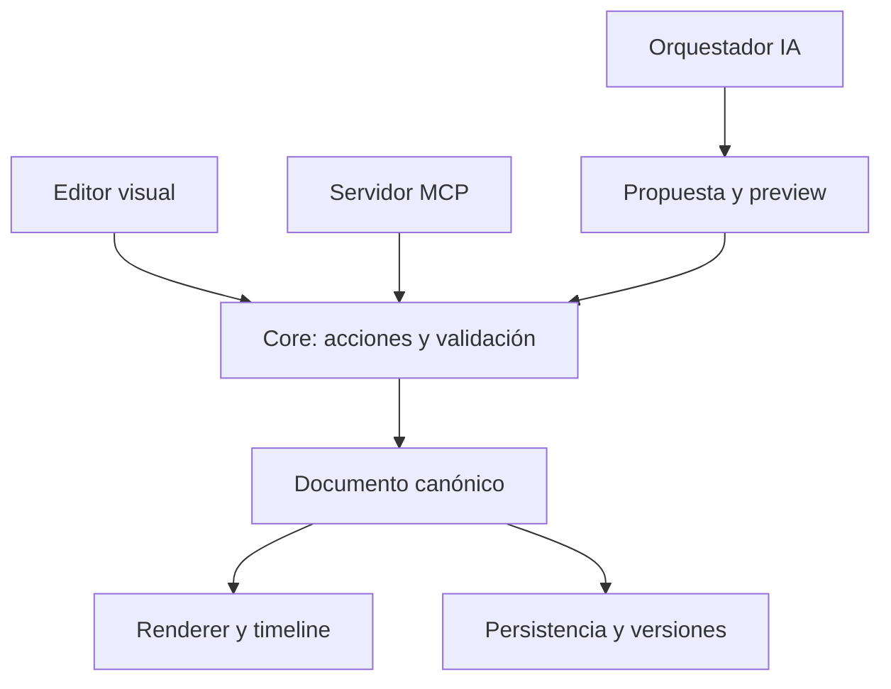

# Arquitectura y decisiones de base

## Monorepo TypeScript

React/Vite para el editor. SVG para la primera implementación del engine visual. Un paquete puro para documento/acciones/geometría. MCP stdio con SDK oficial v2. Dependencias fijadas en package-lock.json; no usar «latest» en instalaciones rutinarias.

Elegimos SVG para arrancar con editabilidad, texto seleccionable, geometría exacta y exportación. Esta base no demuestra escalabilidad a decenas de miles de elementos. Medir con fixtures de 100/500/2000 nodos antes de decidir virtualización, Canvas/WebGL o un motor externo. Registrar licencias si se evalúan React Flow, tldraw u otros motores.

## Separación de responsabilidades

Las vistas no modifican arrays del documento directamente. Todo cambio de contenido pasa por el command bus. Contexto/cámara/selección/playhead son estado aparte. Render nunca genera nuevos IDs.

## Estado actual (01/10/2026)

El navegador guarda un documento en localStorage con indicador de guardado, aviso de fallo y recuperación de contenido ilegible. Undo usa snapshots de sesión limitados a 100. El servidor MCP guarda UN archivo configurado en su entorno mediante write/rename y lock de archivo. **Son persistencias separadas**, unidas por import/export manual. No fingir que están sincronizadas. P5 debe introducir el transport/bus compartido.

Editor (`apps/editor/src`): `store/` (documentStore, viewStore, selectionStore, playbackStore sobre un store mínimo propio), `canvas/` (`DiagramLayer` dibuja el documento sin estado y lo comparten canvas, presentación y export; `Canvas` maneja gestos y sólo emite acciones al soltar), `commands.ts` (operaciones compartidas por botones y atajos), `inspector/`, `timeline/`, `presentation/`, `library/`, `assistant/`, `io.tsx`, `shortcuts.ts`.

Gateway de IA (`apps/api`, node:http, sólo loopback): el editor lo alcanza por el proxy `/api` del servidor de desarrollo. Recibe el documento en cada pedido, no lo persiste y nunca aplica cambios: devuelve propuestas validadas. Adapters en `packages/providers`. Todavía no es el backend multiusuario de P4.

## Backend previsto

Servicio Node/TypeScript con Fastify, PostgreSQL para proyectos/documentos/versiones y almacenamiento compatible con S3 para assets. Las rutas, repositorios y workers comparten el core. No duplicar modelos JSON con otra fuente de verdad.

Inicialmente documento como JSONB + revision. Versiones inmutables separadas y registro de acciones. No desnormalizar todos los elementos en filas sin una necesidad medida. Modelo relacional propuesto: users, projects, project_members, documents, document_versions, ai_conversations, ai_requests, usage_events, asset_jobs, assets. OIDC mediante un proveedor/librería mantenida; elegir y registrar la decisión en P4. No desarrollar un servidor de identidad casero.

Guardar con `UPDATE documents SET content=?, revision=revision+1 WHERE id=? AND revision=? AND permission_checked`. Si no actualiza una fila, conflicto. Validación/permisos también en servidor, nunca solamente en React. Cambios y recibos de idempotencia dentro de la misma transacción DB.

## Pipeline de IA

1. Capturar documentId, revision, selección, región y presupuesto.
2. Construir contexto: elementos relevantes y vecindario; resumen para lo que queda afuera.
3. Enviar instrucciones/contrato al adapter elegido.
4. Recibir texto de análisis o un lote estructurado; nunca eval ni JSX de confianza.
5. Parsear y validar schema, IDs, semántica, límites, permisos y layout.
6. Crear preview aislado. Dif y progreso visibles. El documento actual no cambia durante la generación.
7. Al aceptar, volver a validar revision/permisos y aplicar atómicamente.
8. Registrar tokens/latencia/modelo, sin guardar claves ni datos sensibles completos en logs.

Para mostrar «paso a paso», ejecutar las acciones sobre una copia de staging. La aceptación compromete el lote validado completo. Cancelar descarta staging; no deja medio diagrama. Si el usuario edita mientras la IA responde, ofrecer rebase explícito o regenerar con revision nueva.

## Animación

Documento describe intención (`nodeIds`, `edgeIds`, duración, tono, cámaras futuras). Renderer calcula posición por longitud de ruta. Timeline controla tiempo; no modifica los nodos canónicos para resaltar. Paralelismo: varios edges en un paso. Ramas: escenarios/triggers explícitos, no afirmar que ejecutamos pagos o simulación real. Historial de edición y animación no comparten playhead.

## Layout relativo

El core actual soporta `inside`, `insideLabel`, `below`, `above`, `rightOf` y `leftOf` con gap; detecta colisiones y ofrece layout global determinista por bloques. Las conexiones pueden usar puertos o enganches en cualquier punto del borde. «Ordenar selección» conserva elementos externos; «Ordenar todo» reubica el documento completo. Una restricción incompatible falla con mensaje. El layout reserva espacio aproximado para etiquetas, pero no garantiza eliminar cada cruce entre conexiones o cada superposición de rutas manuales/curvas. Constraints persistentes y prioridades entre ellas siguen pendientes.

## MCP y providers

MCP expone operaciones y contexto a un host de IA; no realiza inferencia por sí mismo. Tools usan core y revisión. stdio local ahora; Streamable HTTP + OAuth y scopes para uso remoto en P5. Host tools no debe bypassar permisos de proyectos. Adapters de OpenAI/Anthropic/Gemini/local se implementan como módulos independientes y declaran structured outputs, streaming, vision y límites que realmente soportan.

## Higgsfield

Adapter de jobs, no dependencia del core. Inputs: brief, referencias autorizadas y formato; output: asset con procedencia, estado, versión y uso. Texto, nodos, flechas y estructura técnica siguen siendo nativos. Confirmar API y permisos reales antes de fijar endpoints/modelos. Un plugin instalado en el entorno del agente no otorga automáticamente acceso comercial al SaaS de Diagramia.

## Evolución

Backend/repo y bus compartido antes de colaboración. Migraciones explicitas entre schemaVersion. ID estable y referencias permiten futuras features, pero no agregar campos arbitrarios sin contrato. Tests de regresión con los ejemplos complejos son parte de cada migración.
